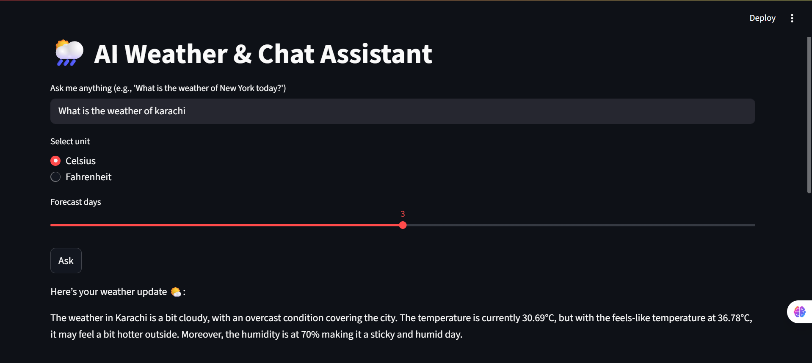
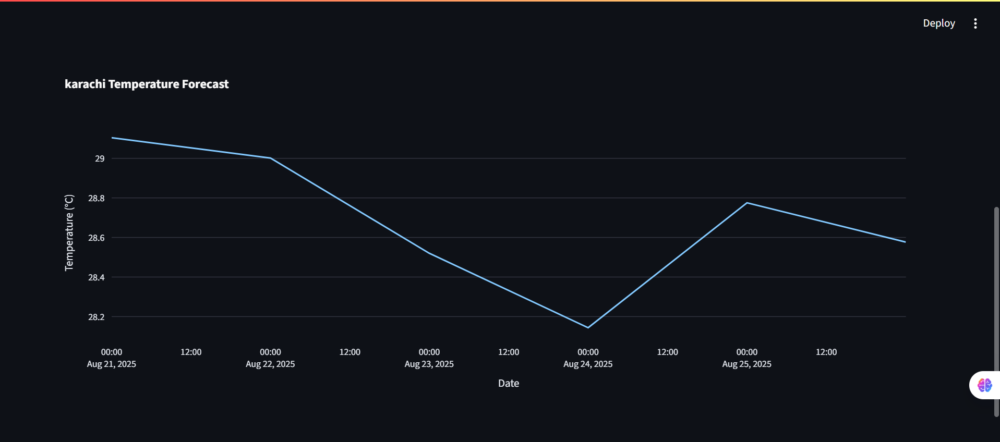

# 🌦️ AI Weather & Chat Assistant

An interactive **Streamlit web app** that provides **real-time weather updates** for any city worldwide and answers general chat queries using an **LLM (Groq API)**.  

## **Features**

- Fetches **real-time weather data** using the **OpenWeather API**.  
- Generates **friendly, human-readable weather reports** in 4–5 sentences using **Groq LLM**.  
- Handles **general chat queries** using the same LLM.  
- Clean separation of **API keys** using `.env` for security.  
- User-friendly interface built with **Streamlit**.  

## **Demo**

Here are some screenshots of the AI Weather & Chat Assistant in action:  
  
  

## **Installation**

```bash
# 1. Clone the repository
git clone https://github.com/yourusername/weather-chat-assistant.git
cd weather-chat-assistant

# 2. Create a virtual environment
python -m venv venv

# 3. Activate the virtual environment
# Windows:
venv\Scripts\activate
# Mac/Linux:
source venv/bin/activate

# 4. Install dependencies
pip install -r requirements.txt

# 5. Set up environment variables
# Open `.env` and add:
OPENWEATHER_API_KEY=your_openweather_key_here
GROQ_API_KEY=your_groq_key_here

## **Usage**

1. Run the Streamlit app:

   streamlit run app.py

2. Open the URL shown in your terminal (usually `http://localhost:8501`) in a browser.  

3. Type a query in the input box:

   - Weather query:  
     What is the weather in London today?

   - General chat query:  
     Tell me a fun fact about space.

4. Click **Ask** to get the AI-generated response.

## **Project Structure**
AI-Weather-Chat-Assistant/
├─ app.py                 # Streamlit app  
├─ utils.py               # Functions for weather fetching & LLM  
├─ requirements.txt       # Python dependencies  
├─ README.md              # Project documentation  
├─ .gitignore             # Files to ignore in git  
├─ .env                   # To store secrets API keys  
├─ images/                # Images  
│   ├─ Image1.png  
│   └─ Image2.png  
├─ models/                # (Optional) Local ML models  
└─ notebooks/             # (Optional) Exploration notebooks

## **Environment Variables**

OPENWEATHER_API_KEY  # API key for OpenWeather API (fetches live weather data)  
GROQ_API_KEY         # API key for Groq LLM (handles chat & weather report generation)

## **Dependencies**

- Python 3.7+  
- Streamlit  
- Requests  
- Groq Python SDK  
- python-dotenv  

## **Future Improvements**

- Add **voice input & output** so users can speak their queries and get audio weather reports.  
- Integrate **severe weather alerts & notifications** for storms, rain, or heatwaves.  
- Provide **historical weather data** for a specific date or comparison over time.  
- Display **interactive maps** with weather overlays (temperature, clouds, rain).  
- Give **weather-based suggestions** like clothing or activity recommendations.  
- Allow users to **save favorite cities** for quick daily weather updates.  
- Enhance **chat features** with weather-based jokes, trivia, or fun facts.  
- Show **graphical trends** of temperature, humidity, or precipitation for the past week.  
- Integrate with **Google Calendar** to plan events based on the forecast.  
- Add **multi-language support** for weather reports and chat responses.  

## **Contact**

Created by Muhammad Abdullah  
📧 Email: abdullah2648.khan@gmail.com  
📞 Phone: +92-319-9539210  

